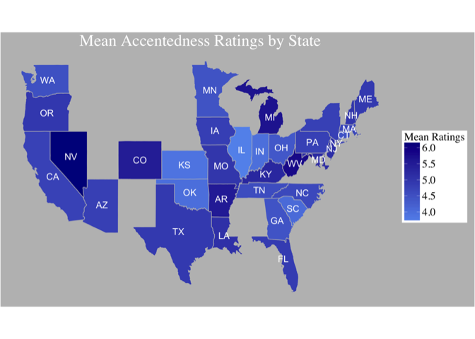
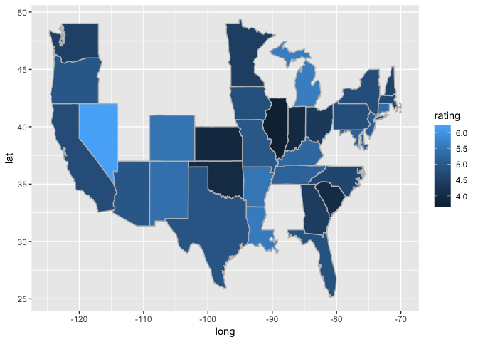
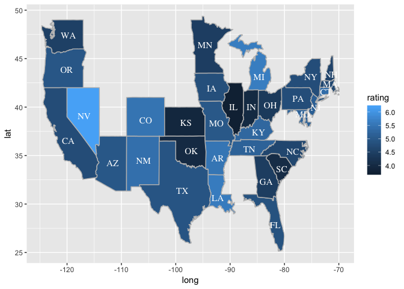
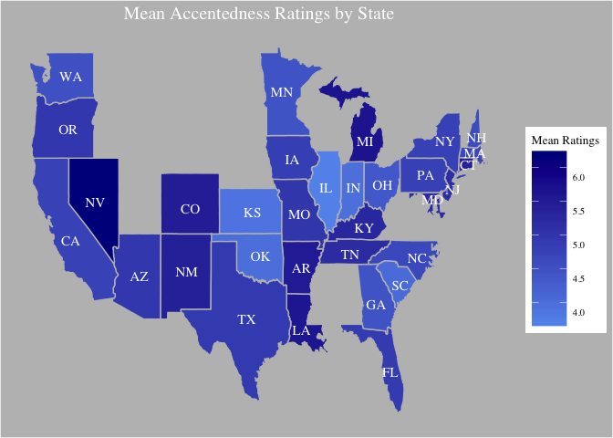

Choropleth Map in R with ggplot
================
Zhiyan Gao
12/5/2016

Introduction
------------

I conducted an experiment on Amazon Mechanical Turk, where native English speakers from across the U.S. provided their judgement on the accentedness of 1oo nonnative speech samples. As my aim was to investigate the phonetic features of foreign accents, sociolinguistic aspects of accentedness perception did not make the cut in my paper. However, since I already collected raters’ demographic information, it would be a shame not to do anything about it.

Here, I plotted a choropleth map in r with the ggplot2 package. Mean accentedness ratings were calculated for raters from each state. The higher the number, the more accented the 100 speech sample sounded to the raters. I should note that raters in my experiment made their judgment on a likert scale. The range was 1 to 9, where 1 means “no foreign accent at all”, and 9 means “very heavy accent”.

Here’s the figure I made with ggplot2. The darker the color, the more accented the speech samples sounded to the raters. One can observe that the same 100 speech samples were more accented to people living in Nevada than to people living in Illinois. Of course, the sample size for each state is not the same. One should not draw any conclusions based on the figure below. The purpose of this post is purely to show how the figure was made.



step 1: attach geographic coordinates
-------------------------------------

Load geographic coordinates of each US state (contained in the ggplot2 package), give it a name; Load my own data sheet, which on my computer is called alldata2.csv,then give it a name.

``` r
library(ggplot2)
all_states<-map_data("state")
mturkData<-read.csv("alldata2.csv",header=T)
```

step 2: calculate the mean ratings for each “region”
----------------------------------------------------

in my data, “region” refers to the states where the participants current reside. Notice that the names of states are in lower case.

``` r
states<-aggregate(rating~region,mturkData,mean)
head(states)
```

    ##        region   rating
    ## 1     arizona 4.960000
    ## 2    arkansas 5.500000
    ## 3  california 4.757059
    ## 4    colorado 5.480000
    ## 5 connecticut 5.360000
    ## 6     florida 4.867500

step 3: merge two dataset
-------------------------

Merge the two dataset, give it a name. It is important that the "region" variable is a "factor".

``` r
total<-merge(all_states,states,y.by="region")
total$region<-factor(total$region)
total <- total[order(total$order),] # order the data [very important!]
```

step 4: let's draw the map
--------------------------

The long, lat columns in the "total" dataset are coordinates of each state. We can use these two columns to draw the map.

``` r
head(total)
```

    ##      region      long      lat group order subregion rating
    ## 114 arizona -114.6374 35.01918     2   204      <NA>   4.96
    ## 115 arizona -114.6431 35.10512     2   205      <NA>   4.96
    ## 76  arizona -114.6030 35.12231     2   206      <NA>   4.96
    ## 37  arizona -114.5744 35.17961     2   207      <NA>   4.96
    ## 49  arizona -114.5858 35.23690     2   208      <NA>   4.96
    ## 39  arizona -114.5973 35.28274     2   209      <NA>   4.96

``` r
p<-ggplot(total, aes(long, lat, group=group, fill=rating)) +
  geom_polygon(color="grey")
p
```



step 5: add state abbreviations to the figure
---------------------------------------------

The aim of this step is to find the central location of each state, where the state abbreviation should occur. Let's use the state.center list (comes with R) to tell us where exactly the center of the state is. The **state.abb** function changes full names of each state to abbreviations.

``` r
centroids <- data.frame(region=tolower(state.name), long=state.center$x, lat=state.center$y)
centroids$abb<-state.abb[match(centroids$region,tolower(state.name))]
```

I got one more problem. That is, the *centroids* data sheet I just created contains infomation of all 50 states. However, only 32 states are represented in my experiment data. I therefore need to remove 18 states from the *centroids* data sheet.

``` r
# Collect names of the 32 states in my data.
statenames<-data.frame(
  region=levels(total$region)
) 
# Merge it with centroids
centroids<-merge(statenames,centroids,by="region")
head(centroids)
```

    ##        region      long     lat abb
    ## 1     arizona -111.6250 34.2192  AZ
    ## 2    arkansas  -92.2992 34.7336  AR
    ## 3  california -119.7730 36.5341  CA
    ## 4    colorado -105.5130 38.6777  CO
    ## 5 connecticut  -72.3573 41.5928  CT
    ## 6     florida  -81.6850 27.8744  FL

step 6: Draw the map
--------------------

Use annotate function to attach state names to the map.

``` r
p2<-p+
  with(centroids, 
       annotate(geom="text", x = long, y=lat, label = abb, 
                size = 4,color="white",family="Times")
      )
p2
```



step 7: Final touch
-------------------

Change the appearence of the map, with theme functions in R. the theme functions hide labels, tick, and changes fonts. Check ggplot2 theme function for details.

``` r
p3<-p2+
  # change color scheme
  scale_fill_continuous(
  low = "cornflowerblue",high = "darkblue",
  guide=guide_colorbar(barwidth = 2,barheight = 10))+
  # add titles
  labs(fill = "Mean Ratings")+
  ggtitle("Mean Accentedness Ratings by State")+
  # hide ticks on x and y axis
    scale_y_continuous(breaks=c())+ 
  scale_x_continuous(breaks=c()) 
```

``` r
#change themes. Check ggplot documentations if you have no idea what's going here
theme_g<-
  theme(panel.background = element_rect(fill = "grey"),
        plot.background = element_rect(fill = "grey"),
        axis.title.x = element_blank(),
        axis.title.y = element_blank(),
        axis.ticks = element_blank(),
        panel.border =  element_blank(),
        plot.title = element_text(
          size = 15, hjust = 0.5, family = "Times",colour = "white"),
        legend.title= element_text(
          hjust = 0.4 ,vjust=0.3, size=10,family = "Times"),
        legend.text = element_text(
          hjust = 0.4 ,vjust=2, size=8,family = "Times")
  )
```

``` r
#attach the theme to our graph
p3+
  theme_g
```


